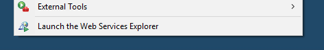
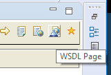
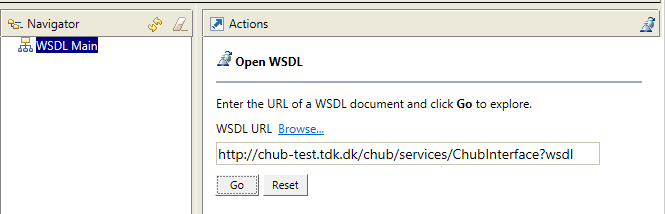
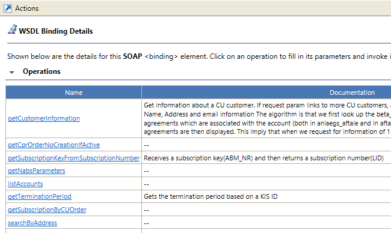

## Getting started with Eclipse Web Service Explorer

Eclipse Java _Enterprise Edition_  has the IBM Web Service Explorer built in.

Invoke from the `Run` menu:

Switch to the WSDL page:

Enter the WSDL url to test, and press "Go":

WSDL is analysed and a list of bindings are presented:

You can now select a binding to get an entry form for invoking that binding against the server.
